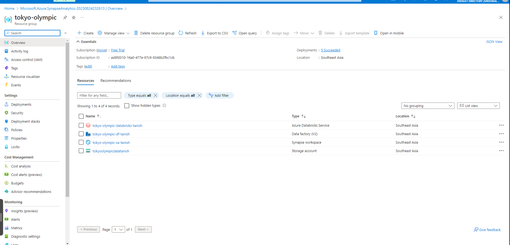
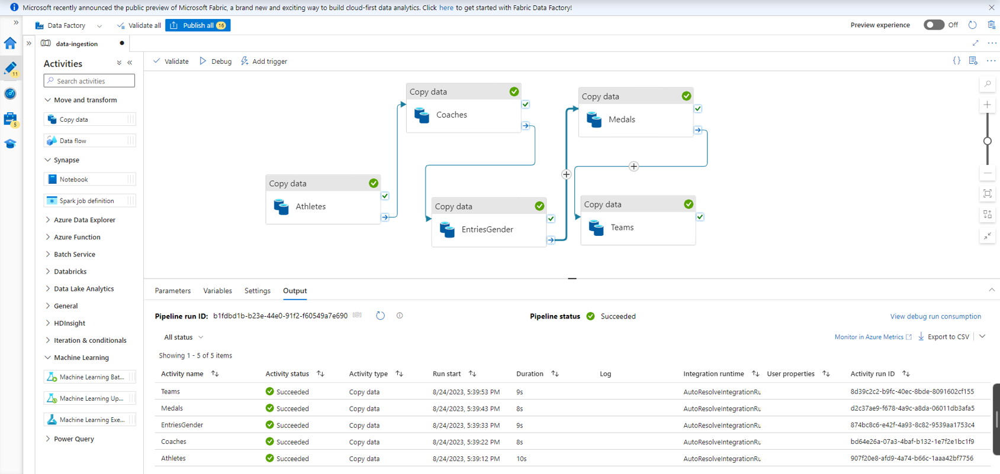

# olympic-data-analysis-azure

The **Tokyo Olympic Data Analysis on Azure** project is a comprehensive solution for analyzing and visualizing Olympic Games data utilizing a range of Azure services. It demonstrates the capabilities of cloud computing and Azure's data services to extract valuable insights from historical Olympic data. By integrating Azure Databricks, Azure Data Factory, and other Azure resources, the project offers a scalable and efficient framework to process, transform, and analyze large datasets related to the Olympic Games.

## Table of Contents
- [Introduction](#introduction)
- [Architecture](#architecture)
- [Technologies Used](#technologies-used)
- [Getting Started](#getting-started)
  - [Prerequisites](#prerequisites)
- [Data Ingestion](#data-ingestion)
- [Data Processing](#data-processing)
- [Conclusion](#conclusion)

## Introduction

The Olympic Data Analysis on Azure project showcases the development of a comprehensive data analysis pipeline using the Azure cloud platform. This project includes the ingestion of raw Olympic data, its transformation into a usable format, thorough analysis, and the creation of insightful visualizations. It exemplifies the integration and utilization of Azure Databricks, Azure Data Factory, and other Azure services to accomplish these tasks effectively.

## Architecture

The architecture of the project consists of the following components:

- **Azure Databricks**: Used for data processing, transformation, and analysis, providing a collaborative and interactive environment for running Spark-based jobs.

- **Azure Data Factory**: Manages and orchestrates the data workflow. It is responsible for data ingestion from various sources, data transformation, and scheduling of jobs.

- **Azure Storage**: Serves as the data lake for storing raw and processed data. It can also host intermediate results generated during the analysis.

- **Azure SQL Database**: Stores the cleaned and transformed data, making it accessible for visualization and reporting.

- **Power BI**: Connects to the Azure SQL Database to create interactive and visually appealing dashboards for data exploration.

## Technologies Used

- Azure Databricks
- Azure Data Factory
- Azure Storage
- Azure SQL Database
- Azure Synapse Analytics

## Getting Started

### Prerequisites

- Azure subscription
- Azure Databricks workspace
- Azure Data Factory instance

## Data Ingestion

## Data Processing

The data processing stage utilizes Azure Databricks' distributed computing capabilities to efficiently clean and transform raw Olympic data into a structured format suitable for analysis.

## Conclusion

The Olympic Data Analysis on Azure project showcases the use of Azure services for processing, analyzing, and visualizing large-scale datasets. By following the setup instructions and guides in this repository, you can customize the project for different domains and enhance its capabilities. Enjoy your data analysis journey!

## Author
https://github.com/Mounikavegi
